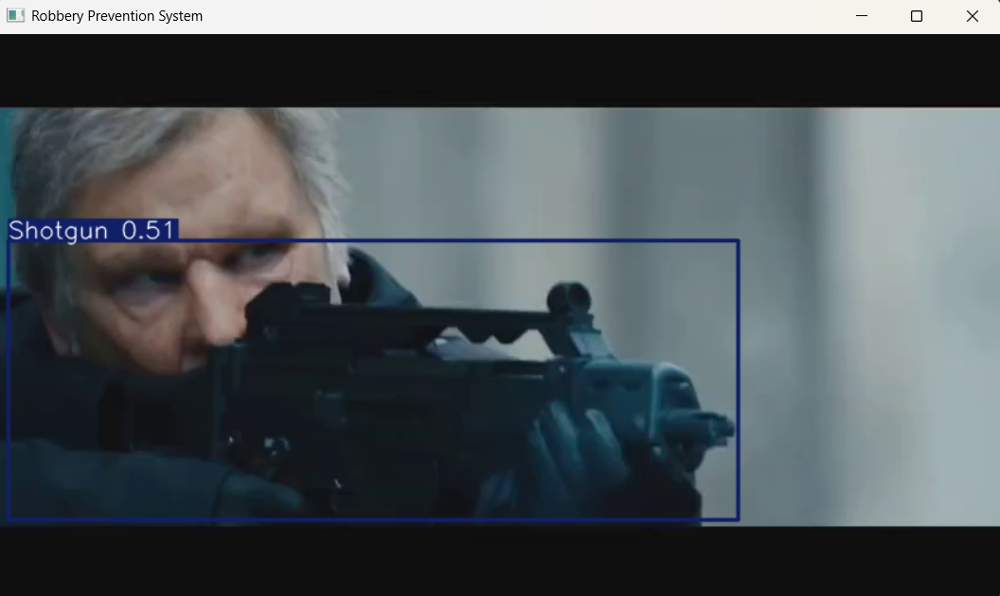
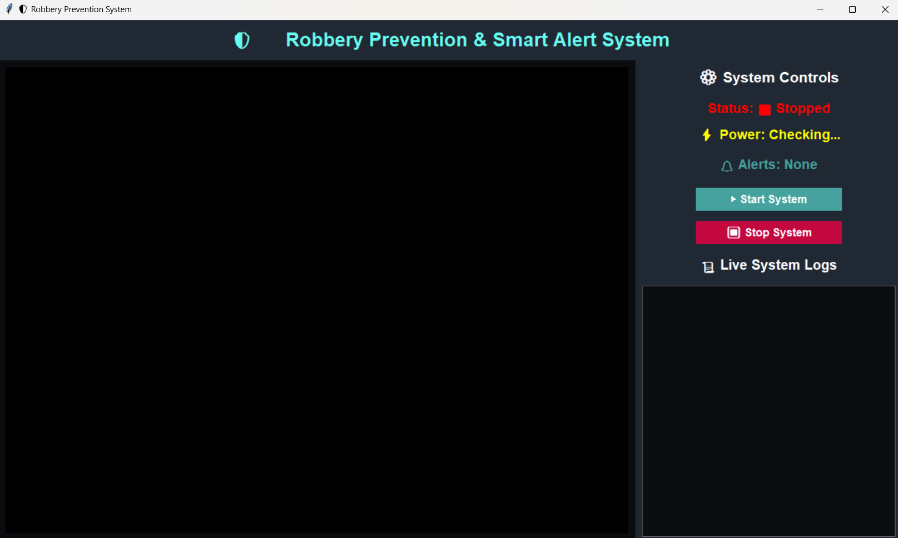
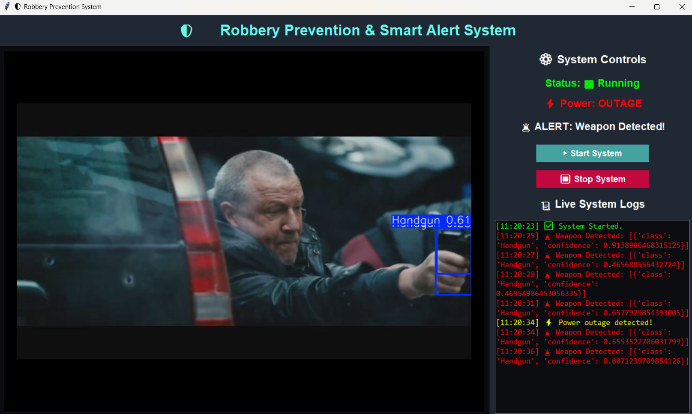
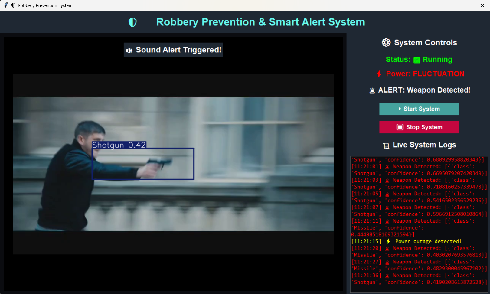
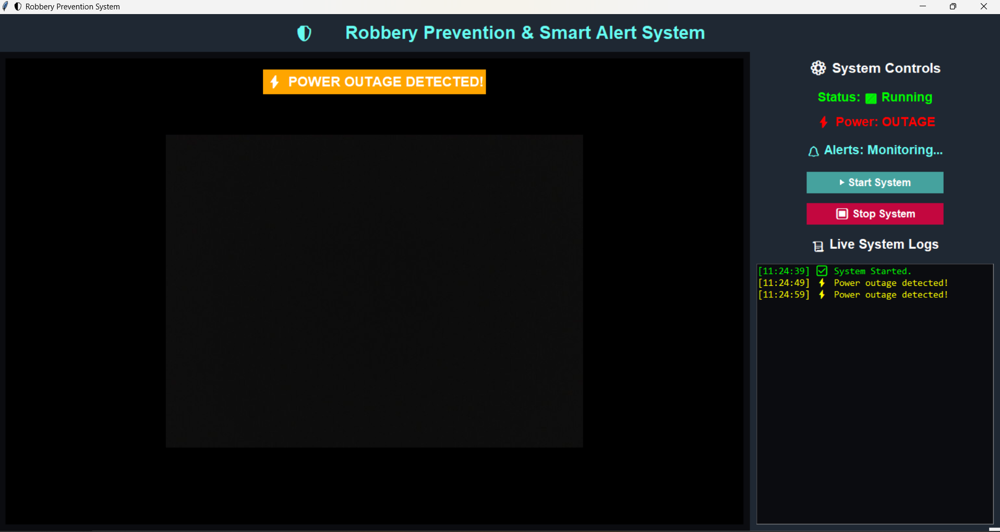
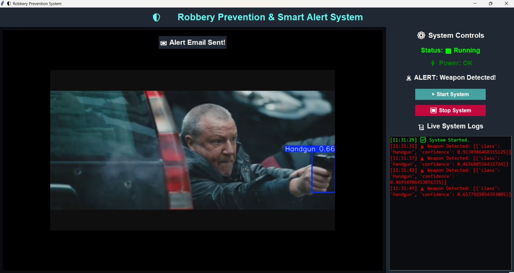

# 🔫 Robbery Prevention & Smart Alert System  
### Real-Time Weapon Detection | Smart Alerts | YOLOv8 + OpenCV + Tkinter

A real-time security surveillance application that detects weapons (Handgun, Shotgun, Knife, etc.) using **YOLOv8**, displays alerts on a **Tkinter dashboard**, and triggers **email + sound alerts** instantly.  
Also features a **power monitoring system** that simulates outages and triggers emergency warnings.

---

## 🚀 Features

- ⚡ **Real-Time Weapon Detection** using YOLOv8  
- 🖥 **Interactive Tkinter GUI Dashboard**  
- 📢 **Sound Alerts** when a weapon is detected  
- 📧 **Email Notifications (SMTP)**  
- 📊 **Live System Logs** with timestamps  
- 🔌 **Power Monitoring System** (OK, OUTAGE, FLUCTUATION)  
- 🧵 **Multithreading** for smooth real-time processing  
- 💾 **JSON configuration** for editable settings  
- 🎥 Works with webcam OR video files  

---

## 📁 Folder Structure
WEAPONDETECTION/
│── alert_system.py
│── alert.mp3
│── config.json
│── detector.py
│── gui_dashboard.py
│── main.py
│── power_monitor.py
│── requirements.txt
│── test_video.mp4
│── test_video1.mp4
│── weapon_yolov8.pt <-- Your trained weights
│── screenshots/ <-- Add your images here
└── .gitignore
---

## 🛠️ Tech Stack

| Component | Technology |
|----------|------------|
| Model | YOLOv8 |
| Framework | OpenCV |
| GUI | Tkinter |
| Alerts | SMTP + Pygame |
| Language | Python |
| Utils | Threading, JSON, Logging |

---

## 📷 Screenshots  

> Upload your images into a folder named **screenshots/** in your repo  
> Then rename them to match these:

### 🔹 **Weapon Detection (YOLOv8 Output)**

### 🔹 **Main Dashboard (Stopped State)**

### 🔹 **Running System – Weapon Detected**

### 🔹 **Sound Alert Triggered**

### 🔹 **Power Outage Notification**

### 🔹 **Email Alert Sent**

---

## 📦 Installation

### 1️⃣ Clone the Repository  
git clone https://github.com/<your-username>/Robbery-Prevention-System.git
cd Robbery-Prevention-System
2️⃣ Install Dependencies
pip install -r requirements.txt

3️⃣ Add Your YOLOv8 Weights

Place your file:

weapon_yolov8.pt

in the project directory.

▶️ Usage
Start the system:
python main.py

Controls (from GUI):
Button	Function
Start System	Starts webcam/video detection
Stop System	Stops detection
Live Logs	Shows real-time alerts
Power Alerts	Displays outage, fluctuation, OK
⚙️ Configuration

Edit config.json:

{
  "use_webcam": false,
  "video_path": "test_video.mp4",
  "confidence_threshold": 0.45,
  "email_sender": "your_email@gmail.com",
  "email_receiver": "receiver@gmail.com"
}

📬 Email Alert Setup

Enable Gmail’s App Password and update config.json.

🤖 YOLOv8 Model

The project uses your trained model:

weapon_yolov8.pt

Replace anytime with newer weights.

📚 Future Enhancements

Cloud-based dashboard

Multi-camera support

SMS alerts

Raspberry Pi deployment

⭐ Show Your Support

Give this repo a ⭐ if you like this project!
